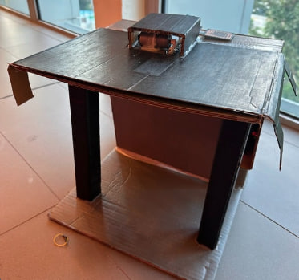
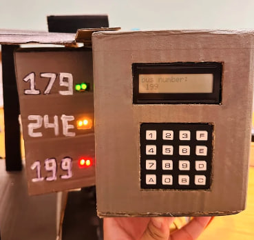
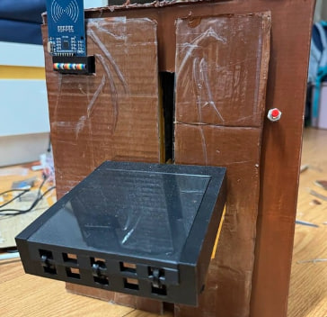

# Welcome to Rest and Ride

## About
_This is a Final Project for MA2012 (Introduction to Mechatronics System Design) AY 24/25 Semester 1_

## Contributors

1. Theodore Amadeo Argasetya Atmadja <a href = "https://github.com/theodoreamadeo">(@theodoreamadeo)</a>
2. Askana Mirza Maulana Irfany
3. Timothy Louis Barus
4. Antonius Ivan Setiawan Rahardja
5. Justin <a href = "https://github.com/sntin">(@sntin)</a>
6. Jason Jonathan
7. Ivan Effendi
8. Michelle Phylicia
9. Mohammed Aldubaisi

## Table of Contents

1. [Background](#section-1)
2. [Problem Statement](#section-2)

## Background

- Increasing aging population.
- The elderly often face mobility challenges: reduced physical strength, health risks, etc.

Even with these issue, public facilities like bus stops are not designed with elderly needs:

Bus stops are lacking of protection from rain and harsh weather: making the transition from bus stop to bus quite dangerous for elderly at a risk of slipping and falling. Traditional seating in bus shelters does not address the physical limitations of elderly passengers, where most elderly having hard time standing up from sitting position. Elderly struggle to flag down buses quickly enough.

#### Key Features :

1. **Shelter**: Shelter will illustrate as the bus stop that already provided with the automatic moveable roof.
2. **Adjustable Sit**: Adjustable sit will assist elderly to sit and stand up properly and safely.
3. **Flag**: Flag will help the elderly to call the bus in the midst of crowd.

## Problem Statement

How can we create a bus stop facility that ensures the safety, comfort, and accessibility of elderly individuals, particularly during harsh weather, while also assisting them with standing up from their seats and providing an easy way to input bus numbers to call for specific buses?
